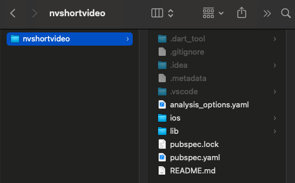
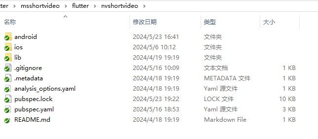
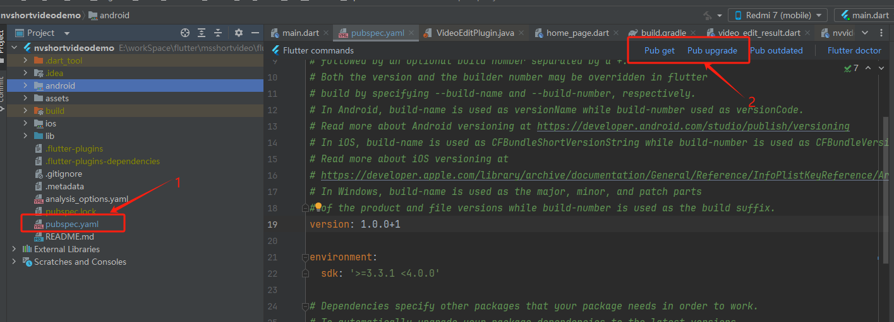
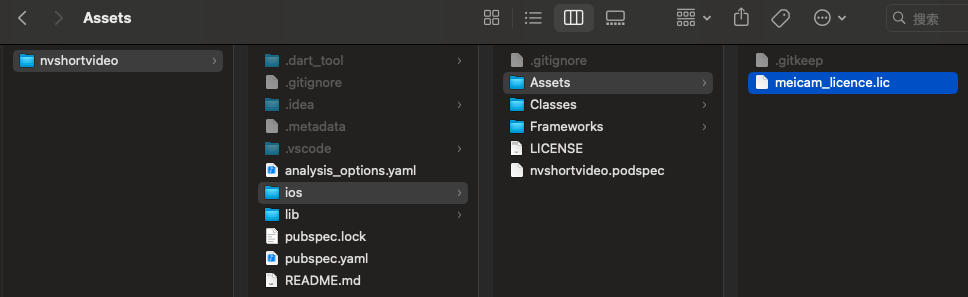
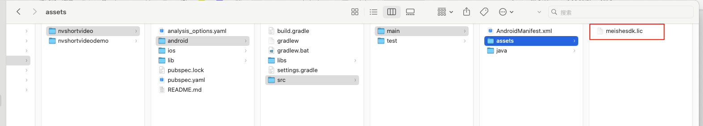

---
html:
    toc: true
print_background: true
---
# Meishe Flutter short video module access guide

## General Integration Process
* First, follow the current documentation for integration.
* Contact the sales department to request SDK authorization.
* By default, ShortVideo uses Meishe's own server. After integration, you will be required to migrate the server to your own server. Contact the sales department and we will arrange for a team to deploy the server for you.
* If you need to modify the current app's display, refer to the UI configuration or module configuration in the current documentation. (If you don't need to modify the UI, ignore this step.)

## Development environment requirements

 - Flutter 2.5.0+
 - iOS   
     - iOS 12.0 and above
     - Swift 5
     - CocoaPods
 - Anroid
     - Android Studio 3.0+

> ⚠️ **Note:**  This feature must be run on a physical device, as it is currently not supported on the simulator.

## Upgrade short video notes
### Version 1.5.1 Updates:
* Fixed some known issues
### Version 1.5.0 Updates:
* This release involves significant updates; therefore, regression testing is absolutely essential prior to deployment—particularly regarding changes to configuration settings.
### 1.4.0Version upgrade：
* When converting the VideoEditPlugin code to Swift, please note the following during upgrades.
* The NvStreamingSdkCore.xcframework has been upgraded to version 3.15.3. If you are upgrading from a version below 1.4.0, you need to contact your business team to update the SDK license. This upgrade is only available for iOS.
* The AutoCut video creation feature has been completely upgraded. You can now contact our server-side development team in a group chat to assist with upgrading the server-side interface. This upgrade is only available for iOS; Android is not yet supported. Therefore, to use the AutoCut video creation feature, you must contact our server-side team for assistance. Please feel free to contact us with any questions.
  ```
      String assetAutoCutUrl = '';
    if (Platform.isAndroid) {
      assetAutoCutUrl = 'materialcenter/recommend/listTemplate';
    } else if (Platform.isIOS) {
      assetAutoCutUrl = 'https://creative.meishesdk.com/api/app/aivideo/asset/all/1';
    }

    //服务器地址
    //Server url
    /// assetRequestUrl  素材列表请求 Material list request
    /// assetCategoryUrl 素材分类列表请求 Material category list request
    /// assetMusiciansUrl 音乐列表请求 Music list request
    /// assetFontUrl 字体列表请求 Font list request
    /// assetDownloadUrl 下载地址请求 Download address request
    /// assetPrefabricatedUrl 预制素材请求 Prefabricated material request
    /// assetAutoCutUrl 一键成片网络请求 AutoCut request
    /// assetTagUrl 模版标签列表请求 Template tag list request
    /// clientId clientId
    /// clientSecret clientSecret
    /// assemblyId assemblyId
    /// isAbroad 海外数据请求，0==全部，1==海外 Overseas data request, 0== all, 1== overseas
    Map<String, dynamic> map = {
      'host': 'https://mall.meishesdk.com/api/shortvideo/v1/',
      'assetRequestUrl': 'materialcenter/mall/custom/listAllAssemblyMaterial',
      'assetCategoryUrl': 'materialcenter/appSdkApi/listTypeAndCategory',
      'assetMusiciansUrl': 'materialcenter/appSdkApi/listMusic',
      'assetFontUrl': 'materialcenter/listFont',
      'assetDownloadUrl': 'materialcenter/mall/custom/materialInteraction',
      'assetPrefabricatedUrl': 'materialcenter/beautyAssets/latest',
      'assetAutoCutUrl': assetAutoCutUrl,
      'assetTagUrl': 'materialcenter/listTemplateTag',
      'clientId': '7480f2bf193d417ea7d93d64',
      'clientSecret': 'e4434ff769404f64b33f462331a80957',
      'assemblyId': 'MEISHE_MATERIAL_LIST',
      'isAbroad': 1
    };
  ```
* For server updates, please contact our server team.
### 1.2.8Version upgrade：
* In version 1.2.7, you need to download resources before entering shooting, editing, and co-shooting. The new version will not block the entry into shooting, editing, and co-shooting, and will silently download in the background when entering. It also provides an interface for users to actively call it. If the user does not actively call shortvideo, it will be called by default.
```dart
Future downloadPrefabricatedMaterial();
```
### 1.2.7 Version upgrade：
* ReactNative users, please replace the flutter/nvshortvideo/ folder and replace the license file (flutter/nvshortvideo/ios/Assets/meicam_licence.lic)
//Shooting entrance
`Future<Bool> startVideoCapture(config: videoConfig);`
//PIP entrance
`Future<Bool> startVideoDualCapture(config: videoConfig);`
//Editing entrance
`Future<Bool> startSelectFilesForEdit(config: videoConfig);`
//Save image to album
`Future<String> saveImageToAlbum();`
//Whether there is only one picture when editing
`Future<bool> isOnlyHaveImage();`
//Show saveing options panel
`Future showSaveOptionsPanel();`

## Support media formats

For details, see: [Meishes sdk product overview](https://www.meishesdk.com/ios/doc_en/html/content/Introduction_8md.html)

## Short video module integration

After the short video module is downloaded and decompressed, it can be used as Flutter’s local private library. The decompressed file directory is as follows:

ios:



Android:



1. Modify the pubspec.yaml file of the App project and add dependencies
  ```
  dependencies:
  flutter:
    sdk: flutter
  nvshortvideo:
    path: XXXX/nvshortvideo
  ```
2. Execute flutter pub get command to download dependencies
3. Update native dependencies
    iOS： cd ios && pod install
  Android：  

1、Double click on the pubspec.yaml file.

2、Click on the Pub get and Pub upgrade buttons.

## System authorization

### iOS
App needs to add the following permissions in Info.plist, otherwise it will not be able to use the short video module.

```xml
<key>NSCameraUsageDescription</key>
<string>AppYour consent is required to access the camera</string>
<key>NSMicrophoneUsageDescription</key>
<string>AppYour consent is required to access the microphone</string>
<key>NSPhotoLibraryUsageDescription</key>
<string>AppYour consent is required to access the album</string>
<key>NSAppleMusicUsageDescription</key>
<string>AppYour consent is required to access music</string>
```
### Android
  TODO：Add the following permissions in AndroidManifest.xml
  ```xml
 <uses-permission android:name="android.permission.SYSTEM_ALERT_WINDOW" />
    <uses-permission android:name="android.permission.CAMERA" />
    <uses-permission android:name="android.permission.RECORD_AUDIO" />
    <uses-permission android:name="android.permission.WRITE_EXTERNAL_STORAGE" />
    <uses-permission android:name="android.permission.READ_EXTERNAL_STORAGE" /> <!-- <uses-permission android:name="android.permission.MOUNT_UNMOUNT_FILESYSTEMS" /> -->
    <uses-permission android:name="android.permission.INTERNET" />
    <uses-permission android:name="android.permission.ACCESS_NETWORK_STATE" />
    <uses-permission android:name="android.permission.VIBRATE" />
    <uses-permission android:name="android.permission.WAKE_LOCK" />
    <uses-permission android:name="android.permission.ACCESS_NOTIFICATION_POLICY" /> <!-- <uses-permission android:name="android.permission.INTERNET" /> -->
    <uses-permission android:name="android.permission.ACCESS_WIFI_STATE" />
    <uses-permission android:name="android.permission.CHANGE_WIFI_STATE" /> <!-- 用于进行网络定位 -->
    <uses-permission android:name="android.permission.ACCESS_COARSE_LOCATION" /> <!-- 用于访问GPS定位 -->
    <uses-permission android:name="android.permission.ACCESS_FINE_LOCATION" /> <!-- 用于读取手机当前的状态 -->
    <uses-permission android:name="android.permission.REQUEST_INSTALL_PACKAGES" />
    <uses-permission android:name="android.permission.EXPAND_STATUS_BAR" />
  ```


## Meishe SDK authorization

After registering as a user on [Meishe‘s official website](https://en.meishesdk.com/), create an application and configure the App package name. After a Meishe business colleague activates the authorization, you can download the authorization file in the application information.

Replace the authorization file in the short video module package with the downloaded authorization .lic file. The path in the module package:
-  iOS：
    
-  Android：
    
> The SDK authorization is bound to the package name of the App. When it is not authorized, all functions of the SDK can be used without checking the authorization, and the drawn picture will have the MEISHE watermark.

## Network interface configuration

The filters, stickers, music and other files used in the short video module are all obtained through the network interface. The server needs to implement the corresponding interface according to the interface document.
Configure the server address and public parameters in the App project.

```dart
import 'package:nvshortvideo/nvshortvideo.dart';
...
    /// assetRequestUrl  素材列表请求 Material list request
    /// assetCategoryUrl 素材分类列表请求 Material category list request
    /// assetMusiciansUrl 音乐列表请求 Music list request
    /// assetFontUrl 字体列表请求 Font list request
    /// assetDownloadUrl 下载地址请求 Download address request
    /// assetPrefabricatedUrl 预制素材请求 Prefabricated material request
    /// assetAutoCutUrl 一键成片网络请求 AutoCut request
    /// assetTagUrl 模版标签列表请求 Template tag list request
    /// clientId clientId
    /// clientSecret clientSecret
    /// assemblyId assemblyId
    /// isAbroad Overseas data request，0==all，1==overseas Overseas data request, 0== all, 1== overseas
    Map<String,dynamic> map = {
      'host':'https://mall.meishesdk.com/api/shortvideo/',
      'assetRequestUrl':'materialcenter/mall/custom/listAllAssemblyMaterial',
      'assetCategoryUrl':'materialcenter/appSdkApi/listTypeAndCategory',
      'assetMusiciansUrl':'materialcenter/appSdkApi/listMusic',
      'assetFontUrl':'materialcenter/appSdkApi/material/listAll',
      'assetDownloadUrl':'materialcenter/mall/custom/materialInteraction',
      'assetPrefabricatedUrl':'materialcenter/beautyAssets/latest',
      'assetAutoCutUrl':'materialcenter/recommend/listTemplate',
      'assetTagUrl':'materialcenter/appSdkApi/listTemplateTag',
      'clientId':'7480f2bf193d417ea7d93d64',
      'clientSecret':'e4434ff769404f64b33f462331a80957',
      'assemblyId':'MEISHE_MATERIAL_LIST',
      'isAbroad':1
    };
    shortVideoOperator().configServerInfo(map);

```

## Preset material

The material packages that the short video module relies on can be selected as needed. For details of preset materials, see: [Short video module preset materials](../../nv_short_video_ios_doc/doc_en/html/PrefabricatedMaterial_en.html)
Download preset materials. If you call this interface, shortvideo will not call it repeatedly when entering. If you do not call it, shortvideo will default to background calling when entering.
```dart
Future downloadPrefabricatedMaterial();
```

## Main methods of short video module

Module singleton：shortVideoOperator()
Call example:

```dart
import 'package:nvshortvideo/nvshortvideo.dart';

NvVideoConfig videoConfig = NvVideoConfig();
shortVideoOperator().startVideoDualCaptrue(config: videoConfig);

```

### Video recording

```dart
 /*! \if ENGLISH
 *
 *  \brief Shooting entrance
 *  \param config Configuration item
 *  \param music The default is nil，If you need to shoot with music, you need to pass an audio object, and the path of the audio must be local and has been downloaded
 *  \else
 *
 *  \brief the entrance of recording
 *  \param config Configuration items
 *  \param music The default is nil. If you need to shoot with music, you need to pass an audio object. The audio path must be local and has been downloaded.
 *  \endif
 */
  startVideoCapture({NvVideoConfig? config, NvMusicInfo? musicInfo});

```

### Picture in Picture

```dart
/*! \if ENGLISH
 *
 *  \brief PIP entrance By default, the album is opened, and a material from the album is taken into the beat
 *  \param config Configuration item
 *  \else
 *
 *  \brief entrance of Picture in Picture, open the photo album by default, take a material from the album and enter the PIP
 *  \param config Configuration items
 *  \endif
 */
  startVideoDualCapture({NvVideoConfig? config});

/*! \if ENGLISH
 *
 *  \brief PIP entrance
 *  \param config Configuration item
 *  \param videoPath The video path to be filmed must be a local path
 *  \else
 *
 *  \brief PIP entrance
 *  \param config Configuration items
 *  \param videoPath The video path to prepare for PIP must be a local path
 *  \endif
 */
  startVideoDualCaptureWithVideo(String videoPath, {NvVideoConfig? config});

```

### Video editing

```dart
/*! \if ENGLISH
 *
 *  \brief Edit entrance
 *  \param config Configuration item
 *  \else
 *
 *  \brief then entrance of editing
 *  \param config Configuration items
 *  \endif
 */
  startSelectFilesForEdit({NvVideoConfig? config});

```

### Video editing complete callback

```dart
/*! \if ENGLISH
 *  \brief Edit module event callback
 *  \else
 *  \brief Edit module event callback
 *  \endif
*/
  setVideoEditEventHandler(Function(NvVideoEditEvent event, Map info)? handler);

```

### Select cover

```dart
/*! \if ENGLISH
 *  \brief Select Cover Image
 *  \else
 *  \brief Select cover
 *  \endif
 */
  Future selectCoverImage();

```

### Save draft

```dart
/*! \if ENGLISH
 *  \brief save draft
 *  \else
 *  \brief Save draft
 *  \endif
*/
  Future saveDraft(String info);

```

### Synthetic video

```dart
/*! \if ENGLISH
 *  \brief Composite video
 *  \else
 *  \brief Synthetic video
 *  \endif
*/
  Future compileCurrentTimeline(Map configure);

```

### Video synthesis callback

```dart
/*! \if ENGLISH
 *  \brief Composite video event callback
 *  \else
 *  \brief Video synthesis event callback
 *  \endif
*/
  setVideoCompileEventHandler(
      Function(NvVideoCompileEvent event, Map compileInfo)? handler);

```

### Save cover image

```dart
/*! \if ENGLISH
 *  \brief save image
 *  \else
 *  \brief save image
 *  \endif
*/
  Future saveImage(String info);
```

### Exit short video module

Call it when the video publishing page exits

```dart
/*! \if ENGLISH
 *
 *  \brief Exit the entire publisher call
 *  \param taskId Returned by the edit completion callback
 *  \warning This method will clean up the current draft and SDK-held resources, please call after completely exiting the editing and publishing process
 *  \else
 *
 *  \brief Exit the entire publisher call
 *  \param taskId Returned by the edit completion callback
 *  \warning This method will clean up the current draft and SDK-held resources, please call after completely exiting the editing and publishing process
 *  \endif
 */
  exitEdit(String taskId);

```

### Get draft list

```dart
/*! \if ENGLISH
 *  \brief get draft list
 *  \else
 *  \brief Get draft list
 *  \endif
*/
  Future getDraftList();
```

### Delete draft

```dart
/*! \if ENGLISH
 *  \brief delete draft
 *  \else
 *  \brief Delete draft
 *  \endif
*/
  Future deleteDraft(String draftId);
```

### Open draft

```dart
/*! \if ENGLISH
 *
 *  \brief Enter the editing portal through draft data recovery
 *  \param draftId Current draft id
 *  \param config Configuration item
 *  \else
 *
 *  \brief Enter the editing portal through draft data recovery
 *  \param draftId Current draft id
 *  \param config Configuration items
 *  \endif
 */
  Future reeditDraft(String draftId, {NvVideoConfig? config});

```

## Module settings

The short video module setting class NvVideoConfig includes function module settings and UI customization. For details, see: [Short video function module settings](../../nv_short_video_ios_doc/doc_en/html/functionConfiguration_en.html)、[Short video UI module settings](../../nv_short_video_ios_doc/doc_en/html/UIConfiguration_en.html)
