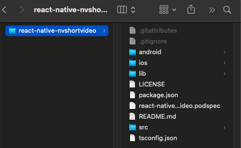
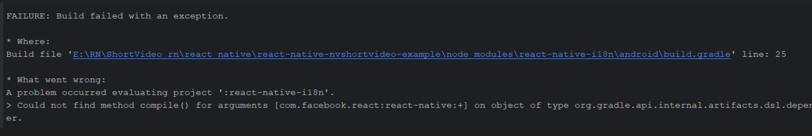
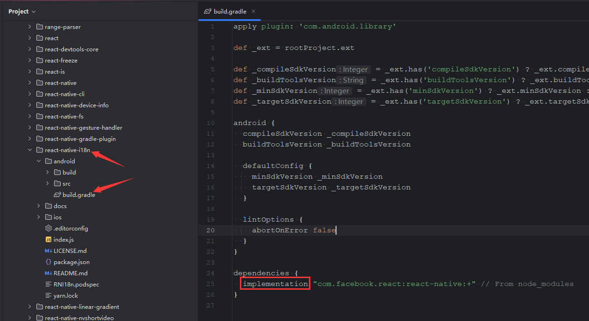
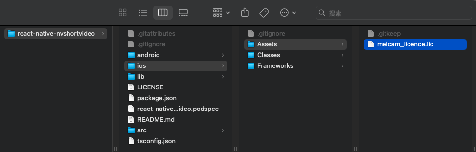
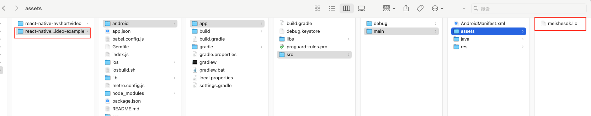

---
html:
    toc: true
print_background: true

---

# 美摄React Native短视频模块接入指引

## 接入大致流程
* 先按照当前文档，集成
* 联系商务要sdk的授权
* shortvideo默认调用的是美摄自己的服务器，接入后要求把服务器移植到客户自己服务器上，这里你可以联系商务，我们会安排同事帮你部署服务器。
* 如果你要修改当前app的显示你可以参考当前文档的UI配置，或者模块配置来修改（如果不需要修改UI，不用理会这一条）

## 开发环境要求

- react-native ^0.41.2
- iOS   
  - iOS 12.0 及以上的 iPhone
  - Swift 5
  - CocoaPods
- Anroid
  - Android Studio 3.0+
  - JDK 17

> ⚠️ **Note:** 需要在真机上运行，模拟器暂不支持

## 升级短视频注意事项
### 1.5.1版本升级:
* 修复了一些已知问题
### 1.5.0版本升级:
* 此版本更新较大，上线之前一定要进行回归测试，尤其是配置项的变化
### 1.4.0版本升级:
* VideoEditPlugin文件有变动，升级的时候需要注意
* NvStreamingSdkCore.xcframework升级到3.15.3，如果你是从1.4.0版本以下升级到这个版本，需要联系商务同事更新sdk授权，这个升级只有ios
* 一键成片做了全新升级，可以在支持群联系服务端开发同事协助升级服务端接口，这个只在ios上做了升级，安卓并没有做升级，所以使用一键成片功能，一定要联系我们的服务端同事协助升级。有任何问题都可以联系我们
  ```
    var assetAutoCutUrl = '';
    if (Platform.OS === 'ios') {
      assetAutoCutUrl = 'https://creative.meishesdk.com/api/app/aivideo/asset/all/1';
    } else {
      assetAutoCutUrl = 'materialcenter/recommend/listTemplate';
    }

  // Initialize server config
  useEffect(() => {
    const map = {
      host: 'https://mall.meishesdk.com/api/shortvideo/v1/',
      assetRequestUrl: 'materialcenter/mall/custom/listAllAssemblyMaterial',
      assetCategoryUrl: 'materialcenter/appSdkApi/listTypeAndCategory',
      assetMusiciansUrl: 'materialcenter/appSdkApi/listMusic',
      assetFontUrl: 'materialcenter/listFont',
      assetDownloadUrl: 'materialcenter/mall/custom/materialInteraction',
      assetPrefabricatedUrl: 'materialcenter/beautyAssets/latest',
      assetAutoCutUrl: assetAutoCutUrl,
      assetTagUrl: 'materialcenter/listTemplateTag',
      clientId: '7480f2bf193d417ea7d93d64',
      clientSecret: 'e4434ff769404f64b33f462331a80957',
      assemblyId: 'MEISHE_MATERIAL_LIST',
      isAbroad: 1,
    };
  ```
* 服务端的更新请联系我们的服务端的同事
### 1.2.8版本升级：
* 1.2.7版本进入拍摄、编辑、合拍时需要先下载资源，新版本不会阻塞进入拍摄、编辑、合拍，会在进入的时候后台默默下载。同时也提供了接口用户也可以主动调用，如果用户不主动调用shortvideo将会默认调用。
```ts
downloadPrefabricatedMaterial(): Promise<boolean>;
```
### 1.2.7版本升级：
* ReactNative端用户，请将react_native/react-native-nvshortvideo/文件夹中进行更换，并更换license文件（flutter/nvshortvideo/ios/Assets/meicam_licence.lic）
//拍摄入口
`startVideoCapture(config: videoConfig): Promise<boolean>;`
//合拍入口
`startVideoDualCapture(config: videoConfig): Promise<boolean>;`
//剪辑入口
`startSelectFilesForEdit(config: videoConfig): Promise<boolean>;`
//保存图片到相册
`saveImageToAlbum(): Promise<string>;`
//剪辑时是否只有一张图片
`isOnlyHaveImage(): Promise<boolean>;`
//展示保存选项面板
`showSaveOptionsPanel():Promise<number>;`

## 支持媒体格式

详见：[美摄sdk产品概述](https://www.meishesdk.com/ios/doc_ch/html/content/Introduction_8md.html)

## 短视频模块集成

短视频模块下载解压后，以npm本地私有库的方式使用，解压后文件目录如下：



1. 添加依赖
   在App项目根目录下执行以下命令：

   ```shell
    yarn add file:xxx/react-native-nvshortvideo
   ```

   > 重要：建议使用yarn命令，如果要使用npm命令，请参考[npm文档](https://docs.npmjs.com/cli/install)

2. 更新原生依赖

    iOS： cd ios && pod install

    Android：

       1.当前项目下执行yarn install
       2.yarn start

3. 答疑

   Android：

   （1）yarn start后运行Android，提示如下错误

   

   解决：

   

## 系统授权

### iOS

App 需要在 Info.plist 中添加以下权限，否则将无法使用短视频模块。

```xml
<key>NSCameraUsageDescription</key>
<string>App需要您的同意,才能访问相机</string>
<key>NSMicrophoneUsageDescription</key>
<string>App需要您的同意,才能访问麦克风</string>
<key>NSPhotoLibraryUsageDescription</key>
<string>App需要您的同意,才能访问相册</string>
<key>NSAppleMusicUsageDescription</key>
<string>App需要您的同意,才能访问音乐</string>
```

### Android

  TODO：在 AndroidManifest.xml 中添加以下权限

```xml
 <uses-permission android:name="android.permission.SYSTEM_ALERT_WINDOW" />
  <uses-permission android:name="android.permission.CAMERA" />
  <uses-permission android:name="android.permission.RECORD_AUDIO" />
  <uses-permission android:name="android.permission.WRITE_EXTERNAL_STORAGE" />
  <uses-permission android:name="android.permission.READ_EXTERNAL_STORAGE" /> <!-- <uses-permission android:name="android.permission.MOUNT_UNMOUNT_FILESYSTEMS" /> -->
  <uses-permission android:name="android.permission.INTERNET" />
  <uses-permission android:name="android.permission.ACCESS_NETWORK_STATE" />
  <uses-permission android:name="android.permission.VIBRATE" />
  <uses-permission android:name="android.permission.WAKE_LOCK" />
  <uses-permission android:name="android.permission.ACCESS_NOTIFICATION_POLICY" /> <!-- <uses-permission android:name="android.permission.INTERNET" /> -->
  <uses-permission android:name="android.permission.ACCESS_WIFI_STATE" />
  <uses-permission android:name="android.permission.CHANGE_WIFI_STATE" /> <!-- 用于进行网络定位 -->
  <uses-permission android:name="android.permission.ACCESS_COARSE_LOCATION" /> <!-- 用于访问GPS定位 -->
  <uses-permission android:name="android.permission.ACCESS_FINE_LOCATION" /> <!-- 用于读取手机当前的状态 -->
  <uses-permission android:name="android.permission.REQUEST_INSTALL_PACKAGES" />
  <uses-permission android:name="android.permission.EXPAND_STATUS_BAR" />
```

## 美摄SDK授权

美摄SDK授权方法：

在[美摄官网](https://www.meishesdk.com)注册用户后，创建应用，配置App包名，由美摄商务同事开通授权后，可在应用信息中下载授权文件。

用下载授权.lic文件替换短视频模块包内的授权文件，模块包内路径：

- iOS：
   
- Android：
   
> SDK授权和App的包名绑定。未授权时，SDK全功能不再检查授权，都可以使用，绘制的画面会带MEISHE水印。

## 网络接口配置

短视频模块用到的滤镜、贴纸、音乐等文件均通过网络接口获取。需要服务端按接口文档实现相应的接口。
在App工程中配置服务器地址及公共参数。

```javascript
import { NvShortVideo, NvVideoConfig } from 'react-native-nvshortvideo';
...
  //服务器地址
  //Server url
  /// assetRequestUrl  素材列表请求 Material list request
  /// assetCategoryUrl 素材分类列表请求 Material category list request
  /// assetMusiciansUrl 音乐列表请求 Music list request
  /// assetFontUrl 字体列表请求 Font list request
  /// assetDownloadUrl 下载地址请求 Download address request
  /// assetPrefabricatedUrl 预制素材请求 Prefabricated material request
  /// assetAutoCutUrl 一键成片网络请求 AutoCut request
  /// assetTagUrl 模版标签列表请求 Template tag list request
  /// clientId clientId
  /// clientSecret clientSecret
  /// assemblyId assemblyId
  /// isAbroad 海外数据请求，0==全部，1==海外 Overseas data request, 0== all, 1== overseas
  let map = {
      'host': 'https://mall.meishesdk.com/api/shortvideo/',
      'assetRequestUrl': 'materialcenter/mall/custom/listAllAssemblyMaterial',
      'assetCategoryUrl': 'materialcenter/appSdkApi/listTypeAndCategory',
      'assetMusiciansUrl': 'materialcenter/appSdkApi/listMusic',
      'assetFontUrl': 'materialcenter/listFont',
      'assetDownloadUrl': 'materialcenter/mall/custom/materialInteraction',
      'assetPrefabricatedUrl': 'materialcenter/beautyAssets/latest',
      'assetAutoCutUrl': 'materialcenter/recommend/listTemplate',
      'assetTagUrl': 'materialcenter/listTemplateTag',
      'clientId': '7480f2bf193d417ea7d93d64',
      'clientSecret': 'e4434ff769404f64b33f462331a80957',
      'assemblyId': 'MEISHE_MATERIAL_LIST',
      'isAbroad': 1
  };
  let videoOperator = NvShortVideo.shareInstance();
  videoOperator.configServerInfo(map);
```

## 预制素材

短视频模块依赖的素材包可根据需要选择。预制素材详见：[短视频模块预制素材](../../nv_short_video_ios_doc/doc_ch/html/PrefabricatedMaterial_ch.html)
下载预置素材,如果你调用这个接口后，shortvideo在进入的时候就不会重复调用，如果你不调用，shortvideo在进入的时候就会默认后台调用。
```ts
/*! \if ENGLISH
 *
 *  \brief Download material
 *  \param completionHandler Completion callback
 *  \else
 *
 *  \brief 下载素材
 *  素材类型
 *  \param completionHandler 完成回调
 *  \endif
 *  */
downloadPrefabricatedMaterial(): Promise<boolean>;
```

## 短视频模块主要方法

模块单例：let videoOperator = NvShortVideo.shareInstance();
调用示例：

```javascript
import { NvShortVideo, NvVideoConfig } from 'react-native-nvshortvideo';

...

let videoOperator = NvShortVideo.shareInstance();
videoOperator.startVideoCaptrue(this.videoConfig);
```

### 视频录制

```javascript
 /*! \if ENGLISH
 *
 *  \brief Shooting entrance
 *  \param config Configuration item
 *  \param music The default is nil，If you need to shoot with music, you need to pass an audio object, and the path of the audio must be local and has been downloaded
 *  \else
 *
 *  \brief 拍摄入口
 *  \param config 配置项
 *  \param music 默认是nil，如果拍摄时需要带音乐拍摄，需要传递一个音频对象，音频的路径必须是本地的，已经下载的路径
 *  \endif
 */
startVideoCaptrue(config?: NvVideoConfig, musicInfo?: NvMusicInfo): void;
```

### 合拍

```javascript
/*! \if ENGLISH
 *
 *  \brief PIP entrance By default, the album is opened, and a material from the album is taken into the beat
 *  \param config Configuration item
 *  \else
 *
 *  \brief 合拍入口，默认打开相册，从相册取一个素材进入合拍
 *  \param config 配置项
 *  \endif
 */
startVideoDualCaptrue(config?: NvVideoConfig): void;

/*! \if ENGLISH
 *
 *  \brief PIP entrance
 *  \param config Configuration item
 *  \param videoPath The video path to be filmed must be a local path
 *  \else
 *
 *  \brief 合拍入口
 *  \param config 配置项
 *  \param videoPath 准备合拍的视频路径，必须是本地路径
 *  \endif
 */
startVideoDualCaptrueWithVideo(videoPath: string, config?: NvVideoConfig): void;
```

### 视频编辑

```javascript
/*! \if ENGLISH
 *
 *  \brief Edit entrance
 *  \param config Configuration item
 *  \else
 *
 *  \brief 编辑入口
 *  \param config 配置项
 *  \endif
 */
startSeleteFilesForEdit(config?: NvVideoConfig): void;
```

### 视频编辑完成回调

```javascript
/*! \if ENGLISH
 *  \brief Edit module event callback
 *  \else
 *  \brief 编辑模块事件回调
 *  \endif
*/
setVideoEditEventHandler(handler?: (event: NvVideoEditEvent, info: Map<string, string>) => void): void;
```

### 选择封面

```javascript
/*! \if ENGLISH
 *  \brief selete cover image
 *  \else
 *  \brief 选择封面图片
 *  \endif
*/
selectCoverImage(): Promise<Map<string, any>>;
```

### 保存草稿

```javascript
/*! \if ENGLISH
 *  \brief save draft
 *  \else
 *  \brief 保存草稿
 *  \endif
 */
saveDraft(info: string): Promise<Map<string, any>>;
```

### 合成视频

```javascript
/*! \if ENGLISH
 *  \brief Composite video
 *  \else
 *  \brief 合成视频
 *  \endif
 */
compileCurrentTimeline(configure: Map<string, string>): Promise<Map<string, any>>;
```

### 视频合成回调

```javascript
/*! \if ENGLISH
 *  \brief Composite video event callback
 *  \else
 *  \brief 视频合成事件回调
 *  \endif
 */
setVideoCompileEventHandler(handler?: (event: NvVideoCompileEvent, compileInfo: Map<string, string>) => void): void;
```

### 保存封面图片

```javascript
/*! \if ENGLISH
 *  \brief save image
 *  \else
 *  \brief 保存图片
 *  \endif
 */
saveImage(coverImagePath: string): Promise<Map<string, any>>;
```

### 退出短视频模块

视频发布页退出时调用

```javascript
/*! \if ENGLISH
 *
 *  \brief Exit the entire publisher call
 *  \param taskId Returned by the edit completion callback
 *  \warning This method will clean up the current draft and SDK-held resources, please call after completely exiting the editing and publishing process
 *  \else
 *
 *  \brief 退出整个发布器调用
 *  \param taskId 由编辑完成回调中返回
 *  \warning 该方法会清理当前草稿以及sdk持有资源，请在完全退出编辑发布流程之后，调用
 *  \endif
 */
  exitEdit(taskId: String): void;
```

### 获取草稿列表

```javascript
/*! \if ENGLISH
 *  \brief get draft list
 *  \else
 *  \brief 获取草稿列表
 *  \endif
*/
getDraftList(): Promise<Map<string, any>>;
```

### 删除草稿

```javascript
/*! \if ENGLISH
 *  \brief delete draft
 *  \else
 *  \brief 删除草稿
 *  \endif
*/
deleteDraft(draftId: string): Promise<Map<string, any>>;
```

### 打开草稿

```javascript
/*! \if ENGLISH
 *
 *  \brief Enter the editing portal through draft data recovery
 *  \param draftId Current draft id
 *  \param config Configuration item
 *  \else
 *
 *  \brief 通过草稿数据恢复，进入编辑入口
 *  \param draftId 当前草稿id
 *  \param config 配置项
 *  \endif
 */
reeditDraft(draftId: string, config?: NvVideoConfig): Promise<Map<string, any>>;
```

## 模块设置

短视频模块设置类NvVideoConfig，包含功能模块设置、UI定制。详见：[短视频功能模块设置](../../nv_short_video_ios_doc/doc_ch/html/functionConfiguration_ch.html)、[短视频UI模块设置](../../nv_short_video_ios_doc/doc_ch/html/UIConfiguration_ch.html)

## 隐私协议

[美摄短视频隐私协议](https://www.meishesdk.com/privacy.html)
